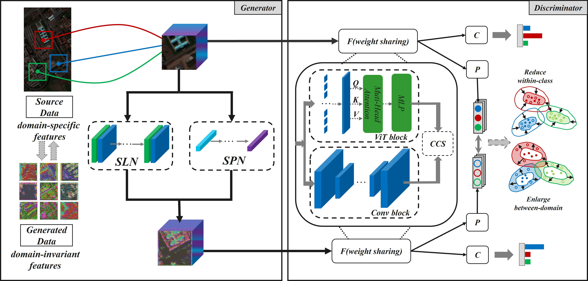

# Domain-Adversarial Generative and Dual Feature Representation Discriminative Network for Hyperspectral Image Domain Generalization.



## Datasets

```
datasets
├── Houston
│   ├── Houston13.mat
│   ├── Houston13_7gt.mat
│   ├── Houston18.mat
│   └── Houston18_7gt.mat
└── Pavia
│   ├── paviaC.mat
│   └── paviaC_7gt.mat
│   ├── paviaU.mat
│   └── paviaU_7gt.mat
└── Indiana
```
   
